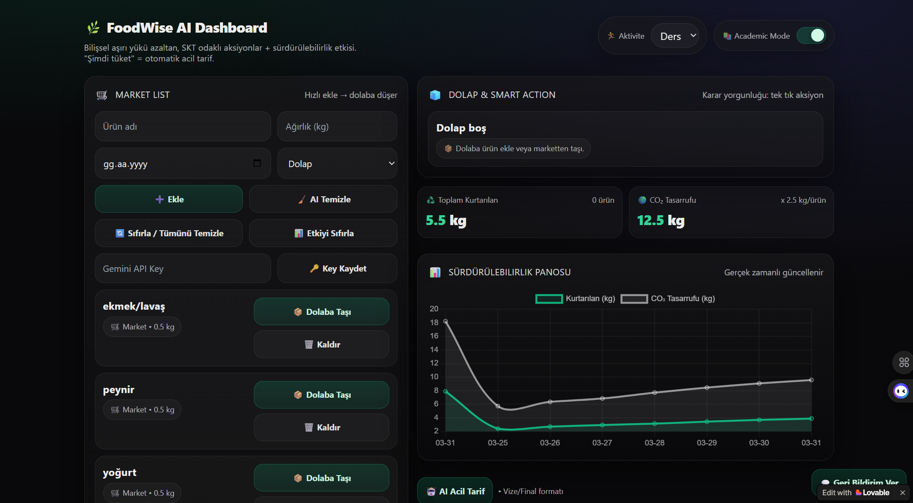

🥗 FoodWise AI: Geleceğin Mutfak Asistanı
FoodWise AI, öğrenci hayatının karmaşasında sürdürülebilirliği ve ekonomiyi bir araya getiren yenilikçi bir mutfak yönetim platformudur. Üniversite öğrencilerinin kısıtlı bütçelerle karşılaştığı plansız alışveriş sorununa ve korkutucu boyutlara ulaşan gıda israfına yapay zeka temelli bir çözüm sunar.

Projem, sadece bir "market listesi" değil; eldeki malzemeleri analiz ederek karbon ayak izini minimize eden tarifler üreten bütünleşik bir ekosistemdir. Google Gemini 2.0 Flash API ile güçlendirilen akıllı algoritması, mutfaktaki her bir gram malzemeyi değerlendirerek israfı sıfıra indirir. Geliştirme sürecinde Cursor’ın mimari gücü ile Lovable’ın çevik kullanıcı deneyimi yeteneklerini harmanlayarak, teknik derinliği estetik bir arayüzle sundum.

Uygulamanın merkezinde yer alan canlı "Sürdürülebilirlik Panosu" (Sustainability Metrics), kullanıcının yaptığı tasarrufu somut verilere dönüştürür. FoodWise AI, teknolojinin bireysel alışkanlıkları iyileştirerek toplumsal bir farkındalık yaratabileceğine olan inancımın fiziksel bir kanıtıdır. Bu platformla sadece yemek yapmayı değil, dünyamızı korumayı da planlıyoruz.!

## 🚀 Proje Bağlantıları
- **Canlı Uygulama:** https://foodwise-plan-ai.lovable.app/
- **Sunum & Demo Videosu (Loom):** https://www.loom.com/share/877157d6e6984e27b7325d413d80b420

